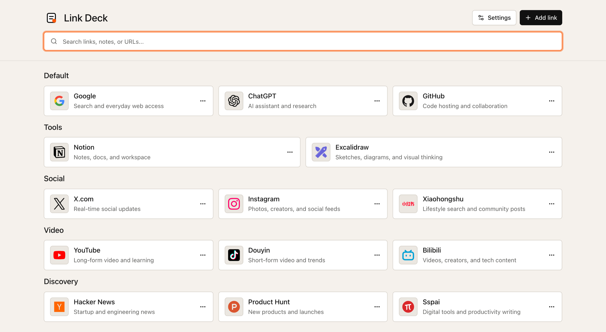

# Link Deck

[简体中文](README_CN.md)

A clean, modern start page for the links you open every day.

Link Deck turns scattered bookmarks into a focused personal launchpad. Group your favorite sites, search them instantly, and keep the whole experience local in your browser.



## What It Is

Link Deck is designed for people who want a beautiful, low-friction home for frequently used links. It is not trying to be a heavy bookmark database or a social sharing platform. It is a calm page that opens fast, looks polished, and keeps your most important destinations one keyboard shortcut away.

Use it as:

- A browser home page or new-tab companion.
- A personal dashboard for work, research, learning, and daily tools.
- A lightweight alternative to messy bookmark folders.
- A local-first link collection that does not require an account.

## Product Highlights

- **Clean by default**: A quiet layout with generous spacing, simple cards, and clear grouping.
- **Modern visual style**: Refined surfaces, compact controls, crisp icon treatment, and three built-in styles: Paper, Slate, and Cobalt.
- **Fast daily access**: Search, open, add, and delete links with keyboard shortcuts.
- **Organized collections**: Keep links in categories such as tools, social, video, discovery, or your own custom groups.
- **Friendly link cards**: Each link can include a title, URL, notes, category, and icon.
- **Flexible icons**: Use automatic favicons, built-in brand icons, image URLs, or local icon files.
- **Personal display settings**: Switch theme color, language, display density, visual style, and link ordering.
- **Portable local data**: Export and import JSON backups whenever you want to move or protect your setup.
- **Offline-ready**: Install it as a PWA and keep using the app even without a network connection.

## Design Advantages

Link Deck emphasizes the experience of repeated daily use:

- **Minimal visual noise**: The interface avoids heavy decoration and keeps attention on the links.
- **Readable at a glance**: Category headings and card structure make the page easy to scan.
- **Consistent rhythm**: Cards align predictably across the grid, making large collections feel manageable.
- **Polished but restrained**: The design feels modern without turning the start page into a marketing landing page.
- **Comfortable density**: Compact, normal, and spacious modes let the interface match different screens and habits.

## Local-First Privacy

Link Deck does not require a backend service or user account. Your links, categories, settings, and uploaded icon files stay in the current browser by default. You decide when to export a backup.

Clearing browser site data, switching browsers, or using private browsing can remove local data. Export a backup after important changes.

## Keyboard Shortcuts

| Action | macOS | Windows / Linux |
| --- | --- | --- |
| Search | `Cmd + K` | `Ctrl + K` |
| Open selected link | `Cmd + Enter` | `Ctrl + Enter` |
| Edit selected link | `Cmd + Shift + E` | `Ctrl + Shift + E` |
| Create link | `Cmd + Shift + O` | `Ctrl + Shift + O` |
| Delete selected link | `Cmd + Shift + Backspace` | `Ctrl + Shift + Backspace` |
| Show shortcuts | `Cmd + /` | `Ctrl + /` |

## Development

Link Deck is built with React, TypeScript, Vite+, Tailwind CSS, Radix UI, dnd-kit, i18next, IndexedDB, and Vite PWA.

```bash
pnpm install
pnpm dev
```

Useful checks:

```bash
pnpm check
```

Production build:

```bash
pnpm build
pnpm preview
```
