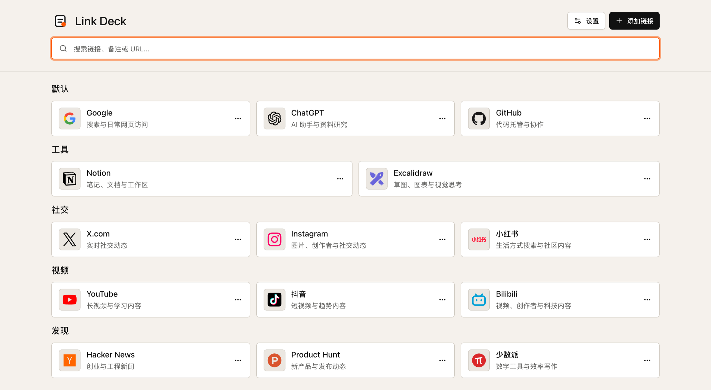

# Link Deck

[English](README.md)

一个现代、简洁的浏览器起始页，用来放置每天都会打开的链接。

Link Deck 把分散的书签整理成一个专注的个人入口。你可以按分类管理常用网站、快速搜索链接，并把数据默认保存在当前浏览器本地。



## 它是什么

Link Deck 面向希望拥有一个漂亮、轻量、低干扰链接入口的人。它不是臃肿的书签数据库，也不是社交化收藏平台，而是一个打开很快、界面清爽、适合每天反复使用的个人启动页。

你可以把它用作：

- 浏览器主页或新标签页搭档。
- 工作、研究、学习和日常工具的个人仪表盘。
- 替代杂乱书签文件夹的轻量链接面板。
- 不需要账号的本地优先链接收藏。

## 产品亮点

- **默认简洁**：安静的页面结构、清晰的卡片和克制的视觉层级，让注意力回到链接本身。
- **现代设计**：细腻的界面质感、紧凑的操作控件、清晰的图标呈现，并内置纸页、石板和钴蓝三种视觉风格。
- **高频操作更快**：支持用快捷键搜索、打开、新建和删除链接。
- **分类更清楚**：可以按工具、社交、视频、发现等主题整理，也可以创建自己的分类。
- **链接卡片友好**：每个链接都可以包含标题、URL、备注、分类和图标。
- **图标来源灵活**：支持自动 favicon、内置品牌图标、图片 URL 和本地图标文件。
- **显示偏好可调**：支持主题色、语言、显示密度、视觉风格和链接排序方式。
- **本地数据可迁移**：可随时导出和导入 JSON 备份，方便迁移或留存。
- **离线可用**：支持 PWA 安装和离线使用。

## 设计优势

Link Deck 更关注“每天重复使用”时的舒适感：

- **视觉噪音低**：不堆砌装饰元素，让页面保持干净。
- **一眼可读**：分类标题和卡片结构清楚，适合快速扫视。
- **节奏稳定**：卡片在网格中整齐排列，链接多了也不显混乱。
- **精致但克制**：界面有现代感，但不会变成营销式落地页。
- **密度可选**：紧凑、正常、宽松三种显示尺寸适配不同屏幕和使用习惯。

## 本地优先与隐私

Link Deck 默认不需要后端服务，也不需要账号。链接、分类、设置和上传的本地图标文件会保存在当前浏览器中。是否导出备份，由你决定。

清理浏览器站点数据、更换浏览器或使用隐私模式可能导致本地数据不可用。重要数据变更后建议导出备份。

## 快捷键

| 操作         | macOS                     | Windows / Linux            |
| ------------ | ------------------------- | -------------------------- |
| 搜索         | `Cmd + K`                 | `Ctrl + K`                 |
| 打开选中链接 | `Cmd + Enter`             | `Ctrl + Enter`             |
| 新建链接     | `Cmd + Shift + O`         | `Ctrl + Shift + O`         |
| 删除选中链接 | `Cmd + Shift + Backspace` | `Ctrl + Shift + Backspace` |
| 显示快捷键   | `Cmd + /`                 | `Ctrl + /`                 |

## 开发

Link Deck 使用 React、TypeScript、Vite+、Tailwind CSS、Radix UI、dnd-kit、i18next、IndexedDB 和 Vite PWA 构建。

```bash
pnpm install
pnpm dev
```

常用检查：

```bash
pnpm check
pnpm tailwind:lint
```

生产构建：

```bash
pnpm build
pnpm preview
```
